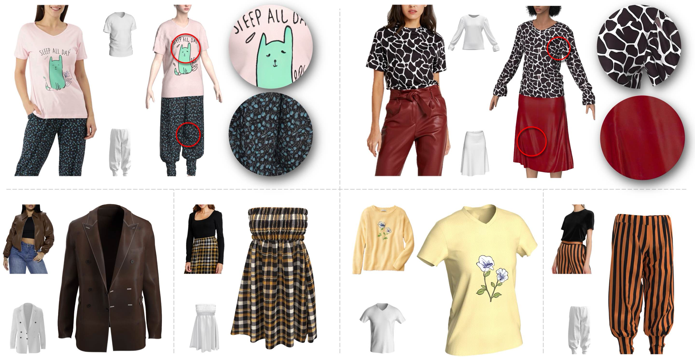

# FabricDiffusion

[](https://dl.acm.org/doi/pdf/10.1145/3680528.3687637)
[](https://arxiv.org/pdf/2410.01801)
[](https://humansensinglab.github.io/fabric-diffusion/)
[](https://youtu.be/xYiyjwldtWc)


## Overview

<p align="center">
    
</p>

> **FabricDiffusion: High-Fidelity Texture Transfer for 3D Garments Generation from In-The-Wild Images**<br>
> [Cheng Zhang*](https://czhang0528.github.io/), 
[Yuanhao Wang*](https://harrywang355.github.io/), 
[Francisco Vicente Carrasco](https://www.linkedin.com/in/francisco-vicente-carrasco-32a508144/), 
[Chenglei Wu](https://sites.google.com/view/chengleiwu/),
[Jinlong Yang](https://is.mpg.de/~jyang), 
[Thabo Beeler](https://thabobeeler.com/), 
[Fernando De la Torre](https://www.cs.cmu.edu/~ftorre/) 
(* indicates equal contribution)<br>
> **SIGGRAPH Asia 2024**

<!-- This repo contains the code for training ITI-GEN and generating images that uniformly span across 
the categories of selected attributes. The main idea behind our approach is leveraging reference images to better represent diverse attributes. 
Key features of our method are:
- Only need datasets that capture the marginal distribution of individual attributes, bypassing the need for datasets that represent joint distributions of multiple attributes.
- The learned token embeddings are generalizable across different generative models. -->


## Updates


**[Jan 2 2025]** Inference code released. 

**[Oct 2 2024]** Paper released to [Arxiv](https://arxiv.org/pdf/2410.01801).


<!-- ## Outline
- [Installation](#installation)
- [Data Preparation](#data-preparation)
- [Training ITI-GEN](#training-iti-gen)
- [Prompt Prepending](#optional-prompt-prepending)
- [Generation](#generation)
  - [Stable Diffusion installation](#stable-diffusion-installation)
  - [Image generation](#image-generation)
- [Evaluation](#evaluation)
- [Acknowledgements](#acknowledgements)
- [Citation](#citation)
- [License](#license) -->


## Installation
Running the codebase only requires installing a recent version of [PyTorch](https://pytorch.org/get-started/locally/), [Diffusers](https://pypi.org/project/diffusers/) and [Transformers](https://pypi.org/project/transformers/):

```angular2html
git clone https://github.com/humansensinglab/fabric-diffusion.git
cd fabric-diffusion
conda env create --file=environment.yml
conda activate fabric-diff
```

## Usage

**1. Texture Normalization**

Run the following command to normalize texture patches cropped from in-the-wild images:

<!-- <p align="center">
  
  
</p> -->

```shell
python inference_texture.py \
    --texture_checkpoint='Yuanhao-Harry-Wang/fabric-diffusion-texture' \
    --src_dir='data/texture_examples' \
    --save_dir='outputs/texture' \
    --n_samples=3
```
- `--texture_checkpoint`: path to the pre-trained texture model checkpoint.
- `--src_dir`: path to the directory containing input images.
- `--save_dir`: path to the output directory.
- `--n_samples`: number of samples per input.

**2. Print Normalization**

Similarly, run the following command to normalize print patches cropped from in-the-wild images:

<!-- <p align="center">
  
  
</p> -->

```shell
python inference_print.py \
    --print_checkpoint='Yuanhao-Harry-Wang/fabric-diffusion-print' \
    --src_dir='data/print_examples' \
    --save_dir='outputs/print' \
    --n_samples=3
```

The model checkpoints are hosted on Huggingface here ([texture](https://huggingface.co/Yuanhao-Harry-Wang/fabric-diffusion-texture/tree/main), [print](https://huggingface.co/Yuanhao-Harry-Wang/fabric-diffusion-logo)).

We are actively adding more features to this repo. Please stay tuned!


## Acknowledgements
- Models
  - [Stable Diffusion](https://github.com/CompVis/stable-diffusion)
  - [InstructPix2Pix](https://github.com/timothybrooks/instruct-pix2pix)
  - [Matfusion](https://github.com/samsartor/matfusion)
  
## Citation
If you find this repo useful, please cite:
```
@inproceedings{zhang2024fabricdiffusion,
    title     = {{FabricDiffusion}: High-Fidelity Texture Transfer for 3D Garments Generation from In-The-Wild Images},
    author    = {Zhang, Cheng and Wang, Yuanhao and Vicente Carrasco, Francisco and Wu, Chenglei and 
                 Yang, Jinlong and Beeler, Thabo and De la Torre, Fernando},
    booktitle = {ACM SIGGRAPH Asia},
    year      = {2024},
}
```

## License
We use the X11 License. This license is identical to the MIT License, 
but with an extra sentence that prohibits using the copyright holders' names (Carnegie Mellon University and Google in our case) for 
advertising or promotional purposes without written permission.
